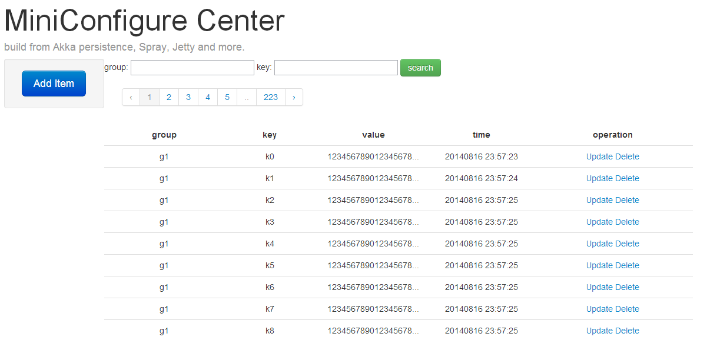

Mini Configuration Center
==================================

Overview
----------
Centralized configuration management, including online editing, persistence, especially the change of the configuration data can be perceived in runtime.

we use Akka persistence/Http/Distributed Data. thanks for Akka toolkit, it make the source code number decreased dramatically,the core code number no more than 300 lines. 

a Configuration = Group  +  Key  +  Value

Mini Configuration Center(miniconf) consists of two parts: server side and client jar. 

- `server side` expose RESTful service(use Akka Http) and use local/distributed akka persistence to save Add/Edit/Query configuration events and use akka Distributed Data to disseminate configuration events between cluster nodes.

- `client jar` provide scala and java interface.

Usage
-----------
### server side
the main class is miniconf.server.MainApp, you can run it.

### web page
- the main page url is http://your server ip:9000/ (the default port is 9000)

###conf
in conf directory, you can edit application.conf for custom need.

Reference configuration
       
       # cluster configure detail
       akka.cluster {
	  seed-nodes = [
	    "akka.tcp://miniconf-system@127.0.0.1:2551"]
	
	  auto-down-unreachable-after = 30s
	}
	
	akka {
	  remote {
	    log-remote-lifecycle-events = off
	    netty.tcp {
	      hostname = "127.0.0.1"
	      port = 2551
	    }
	  }
	}
	
	# http service configure detail
	miniconf {
	  httpService {
	    interface = "127.0.0.1"
	    port      = 9000
	  }
	}
     
Client jar
--------------
### Add One Configuration
		// create MiniConfClient instance
		val theMiniConfClient = new MiniConfClient("http://localhost:9000")
		// saveOneConfItem
		theMiniConfClient.saveOneConfItem("g2", "k1", "gv2")

### Get One Configuration
		val theMiniConfClient = new MiniConfClient("http://localhost:9000")
		theMiniConfClient.getOneConfItem("g2", "k1")

### Register Data modified Listener
		val theMiniConfClient = new MiniConfClient("http://localhost:9000")
		theMiniConfClient.registerListener("g2", "k1", {newValue => System.out.println("conf have modified "+newValue)})

Features
--------------
1.use Akka HTTP to expose Rest Services.

2.use Akka Persistence to persist all configures in local.

3.use Akka Distributed Data to disseminate configuration events between cluster nodes.

License
--------------
This code is open source software licensed under the Apache 2.0 License.
